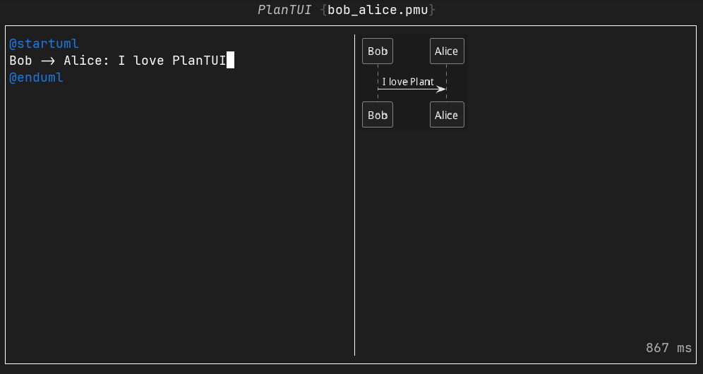

# PlanTUI



> [!WARN]
> You must have a command called `plantuml` which points towards your plantuml compiler. Likely by creating an alias to `java -jar my_compiler`.

PlantUML editor and renderer in your terminal.

> [!NOTE]
> It will use graphical protocols like Kitty when available and unicode ASCII otherwise

## How to use

### From existing file

```shell
plantui --input examples/bob_alice.pmu
```

### Temp

```shell
plantui
```